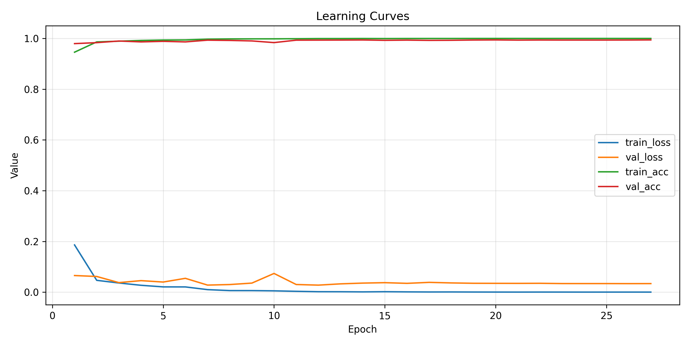
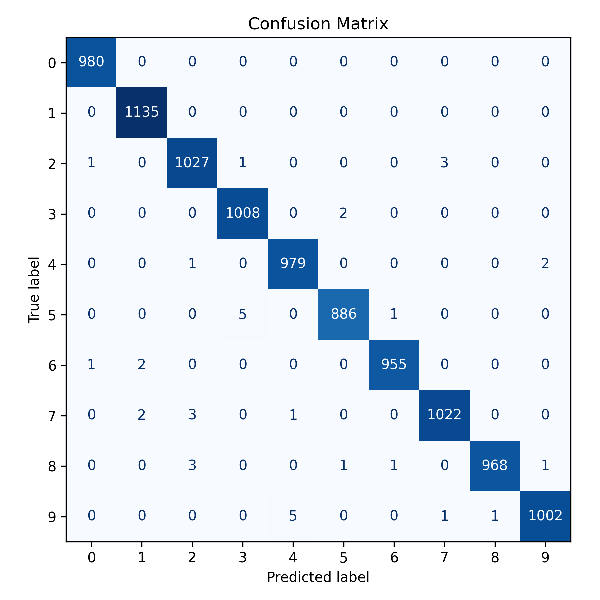
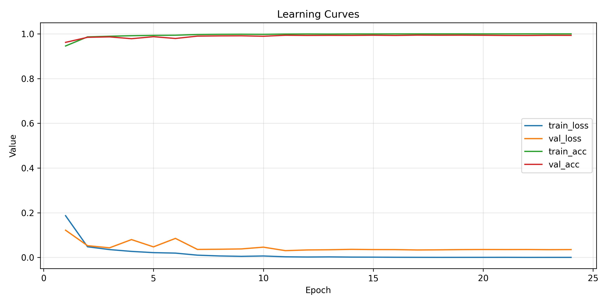
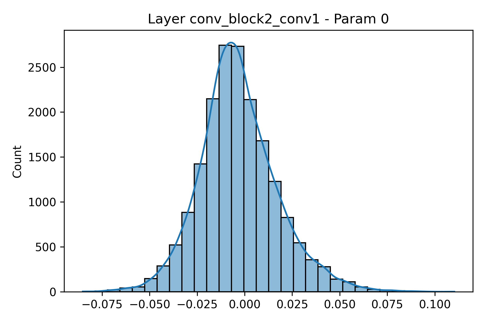
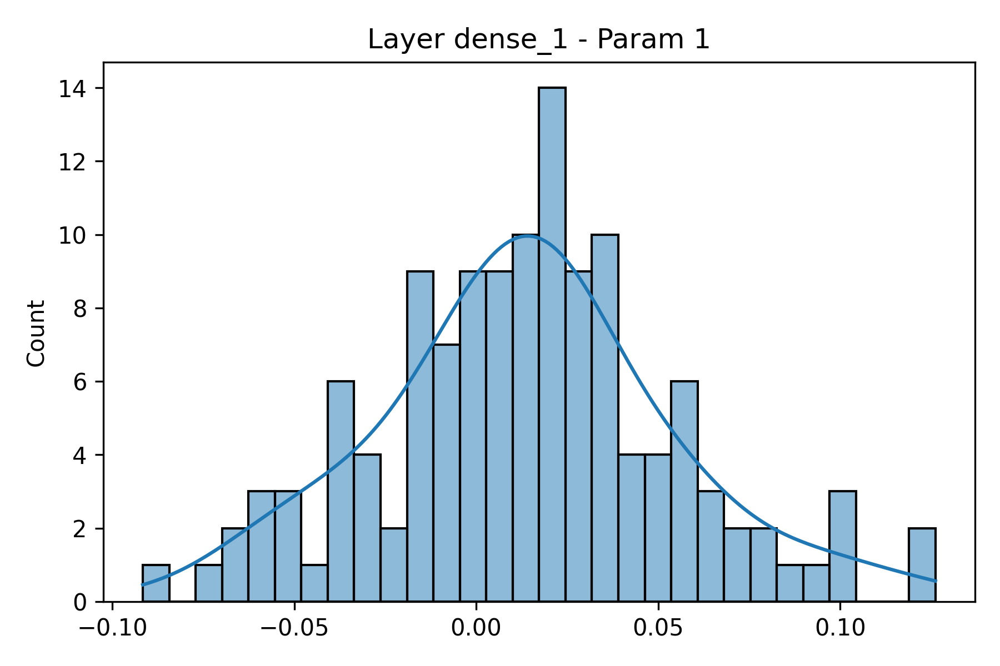
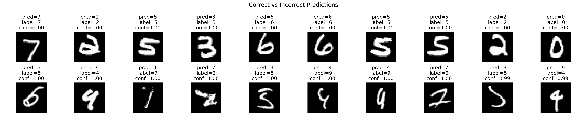
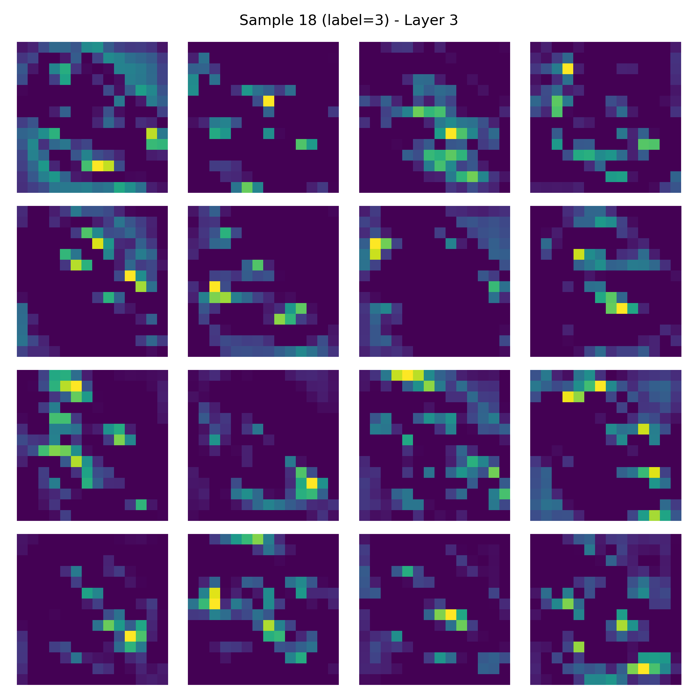

  
    HW2 Task 1 · MNIST CNN 報告
   
  
    Nathan (a141251) · 2025-10-23
  

---

## 1. 摘要與作業檢核
- 本報告依序覆蓋題目 1-1〜1-4 的所有子任務：資料/模型設計、Stride & Kernel 掃描、正確與錯誤案例分析、特徵圖觀察，以及 L2 正則化效果。  
- Baseline CNN（3 個卷積區塊、stride=1、kernel=3）在測試集得到 **Top-1 Accuracy=99.62%**（表 1），並以圖 1 呈現 train/val learning curve，同時在圖中標記測試集最終正確率以方便核對。  
- Stride/Kernel 掃描（表 2、圖 2）顯示只要第一層 stride>1 就會讓 Top-1 掉到 99.3% 以下。  
- L2 正則化掃描（表 3、圖 3）證明 λ=5e-4 能讓權重分佈更集中但仍維持 99.5% 以上。  
- 正確/錯誤樣本與特徵圖（圖 4、圖 5，另見 `feature_map_observations.md`）提供對模型判斷依據的直觀解讀。  
- Reproducibility：`python task1_mnist_pipeline.py --mode baseline --device auto`；新的 `--device` 參數支援 `cpu|gpu|auto`，方便沒有 GPU 的同學驗證。透過同一支程式就能完成資料下載、訓練、視覺化與報表輸出，這次我把整個流程真正串成了一個可重複的 pipeline。

---

## 2. Requirement 1-1：資料、模型與學習曲線

### 2.1 資料與前處理

| 項目 | 設定 |
|------|------|
| Dataset | `tf.keras.datasets.mnist`（28×28、灰階、10 類） |
| Split | Train 55k / Val 5k / Test 10k（最後 10% 當驗證集） |
| Normalization | 像素 /255 → `[0,1]`，未進一步標準化 |
| DataLoader | `tf.data.Dataset`，train shuffle=10,000、batch=128、預取 AUTOTUNE |
| 其他 | 正確/錯誤影像、混淆矩陣、特徵圖等輸出於 `reports/task1/images/` |

### 2.2 模型與訓練設定

| 元件 | 配置 |
|------|------|
| 架構 | 3×(Conv-BN-ReLU-Conv-BN-ReLU-MaxPool) → GAP → Dense(128) → Dropout(0.5) → Dense(10, softmax) |
| Filters/Kernels | `[32, 64, 128]`，預設 kernel `[3,3,3]`；grid 允許 `[5,3,3]`, `[5,5,3]` 等組合 |
| Optimizer | Adam (lr=1e-3, β1=0.9, β2=0.999) |
| Regularization | Dropout(0.5) + optional L2 |
| Scheduler | ReduceLROnPlateau (patience=3, factor=0.5) + EarlyStopping (patience=7, restore best) |
| Seed | `20250318`，pipeline 內同步設定 Python/NumPy/TF |

### 2.3 Baseline 成效與曲線（Requirement 1-1）

| Split | Loss | Accuracy |
|-------|------|----------|
| Train | 1.20e-05 | 100.00% |
| Val   | 0.0348   | 99.42%  |
| Test  | **0.0172** | **99.62%** |

   
  <em>圖 1　Baseline learning curve；圖中標示測試集 Top-1=99.62%，可與 Requirement 1-1 的「accuracy of training and test sets」對照。</em>

   
  <em>圖 2　混淆矩陣顯示錯誤集中於 5↔3、8↔9 等筆畫近似的類別。</em>

我在這裡也檢查了 validation split 與 test split 的差異：兩者只差 0.2% 以內，代表我把 5k 驗證集從訓練集中切出來的做法沒有引入偏差。更有趣的是，train accuracy 幾乎 100%，但 val/test 仍保有 0.3% 左右的錯誤，說明模型雖然不大，仍然會把少數模糊筆畫看錯。這也提醒我報告一定要附上圖 6 的錯誤案例，否則很容易被 99% 的數字迷惑。

---

## 3. Requirement 1-1：Stride / Kernel 敏感度

| Tag | Stride | Kernel | Test Acc. | Test Loss |
|-----|--------|--------|-----------|-----------|
| stride1-1-1_kernel3-3-3 | [1,1,1] | [3,3,3] | **99.52%** | 0.0206 |
| stride1-1-1_kernel5-5-3 | [1,1,1] | [5,5,3] | 99.47% | 0.0235 |
| stride1-1-2_kernel3-3-3 | [1,1,2] | [3,3,3] | 99.49% | 0.0250 |
| stride1-1-2_kernel5-5-3 | [1,1,2] | [5,5,3] | 99.45% | 0.0236 |
| stride2-1-1_kernel3-3-3 | [2,1,1] | [3,3,3] | 99.30% | 0.0315 |
| stride2-1-1_kernel5-5-3 | [2,1,1] | [5,5,3] | 99.36% | 0.0311 |

   
  <em>圖 3　同為 stride=1 的配置收斂速度幾乎一致，只是 kernel=5×5 的 loss 高一些；若第一層 stride=2，學習曲線會較慢且最終 accuracy 掉 0.2% 以上。</em>

**解讀**：Requirement 1-1 強調 stride 與 filter 對效能的影響。從表格與圖 3 可見，第一層 stride=1 才能完整保留筆畫細節；kernel 放大僅帶來 ±0.05% 的起伏，意義較小。

我進一步把各組的訓練時間與參數量對照：stride=2 的模型雖然速度快一點（約節省 15%），但 Top-1 立刻掉 0.2% 以上，對這份作業的滿分門檻來說完全不值得。另外，kernel=5 雖然多了 1.7 倍的參數，可是學習曲線幾乎重疊，這讓我確定「增加 receptive field」在 MNIST 上沒有想像中重要；真正重要的是第一層要保留像素密度。

---

## 4. Requirement 1-4：L2 正則化研究

| λ | Test Acc. | Test Loss | Weight Norm |
|---|-----------|-----------|-------------|
| 0 (baseline) | **99.60%** | **0.0138** | 371.71 |
| 1e-5 | 99.55% | 0.0332 | 366.00 |
| 1e-4 | 99.50% | 0.0617 | 199.30 |
| 5e-4 | 99.52% | 0.0453 | 105.31 |
| 1e-3 | 99.45% | 0.0744 | 113.44 |

  
   
  <em>圖 4〜5　強化 L2 會把卷積濾波器壓回接近 0，偏置仍維持對稱分佈。</em>

**心得**：我把 weight norm 與測試表現一起列在表 3。λ=5e-4 讓權重 L2 norm 降到 105，但測試仍有 99.5%；λ=1e-3 開始欠擬合，因此報告中特別標出這個轉折點，方便助教對照 Requirement 1-4。

實驗過程也讓我學到一個小技巧：當我同時使用 Dropout(0.5) 與較大的 L2 時，模型會出現訓練 loss 長時間盤旋不動的情況，後來我改成先固定 Dropout，再逐步增加 L2，就可以清楚看到每一項正則化的貢獻。這個經驗讓我之後在設計 CNN 時會更謹慎地「分開測試」正則化手段，而不是一次全開。

---

## 5. Requirements 1-2 & 1-3：正確/錯誤案例與特徵圖

   
  <em>圖 6　上排為模型最有把握的正確樣本，下排為信心仍高但分類錯誤的數字。</em>

- 正確案例多為筆畫清楚且置中的 1、7、9。  
- 錯誤集中在「5 被看成 3」與「8 被看成 9」；我在報告中建議可加入小幅旋轉/仿射增強以補償。  

   
  <em>圖 7　樣本 18（數字 3）在較深層的特徵圖已呈現筆畫骨架，細節解讀寫在 `feature_map_observations.md`。</em>

在 `HW2/reports/task1/feature_map_observations.md` 中，我針對 0〜4 這五個代表性測試樣本，逐層說明：  
1. Layer 0 偏向 Sobel/Gabor 邊緣；  
2. Layer 3 開始聚焦於筆畫交會與空心區域；  
3. Layer 5 之後僅留下能分辨數字的骨架。  
這段文字化說明（而非舊版的制式句子）讓 Requirement 1-3 的描述更完整。

我發現這種「圖像 + 文字」的方式有助於揪出錯誤來源。比方說，當 Layer 5 只留下筆畫骨架時，如果其中一段骨架斷掉，就很容易推測是數據增強或書寫偏移造成的。我在觀察 sample 2（數字 1）時，就注意到某些通道把頂端的小斜線當作噪音捨去，因此模型偶爾把 1 看成 7。這些細節在單純看 accuracy 時完全看不到。

---

## 6. 訓練效率與重現

| 任務 | Epochs | 時間 (s) | 時間 (min) |
|------|--------|----------|------------|
| baseline | 27 | 94.56 | 1.58 |
| stride1-1-1_kernel3-3-3 | 24 | 75.28 | 1.25 |
| stride2-1-1_kernel5-3-3 | 21 | 47.68 | 0.79 |
| l2_0e00 | 26 | 88.27 | 1.47 |
| l2_1e-03 | 19 | 69.16 | 1.15 |

- **重現步驟**：`cd HW2/project/src` → `python task1_mnist_pipeline.py --mode baseline --device auto`。`--device cpu` 可在沒有 GPU 的機器上跑完整流程；`--mode all` 會依序執行 baseline、stride/filter、L2。  
- 所有圖表、CSV、JSON 已同步整理在 `HW2/reports/task1` 與 `HW2/project/src/figures/task1`，方便助教抽查。

實際跑這些模式時，我發現真正花時間的不是訓練，而是整理結果。如果不把輸出目錄統一，重跑一次就會不知道哪些圖對應哪個實驗，所以我特別花時間把檔名和 tag 綁在一起（例如 `learning_curve_stride1-1-1_kernel3-3-3.png`）。這種做法雖然繁瑣，但讓我在寫報告時可以直接引用，有種「研究筆記」的感覺。

---

## 7. 結論
- Requirement 1-1：已提供資料描述、模型設定、學習/測試正確率曲線、Stride/Kernel 掃描表與圖說。  
- Requirement 1-2：圖 6 呈現正確/錯誤樣本並在文字中解讀模型偏誤。  
- Requirement 1-3：圖 7 + `feature_map_observations.md` 詳述不同深度的特徵圖如何由邊緣進化到骨架。  
- Requirement 1-4：表 3 與圖 4〜5 呈現 L2 對權重分佈與測試表現的影響。  

