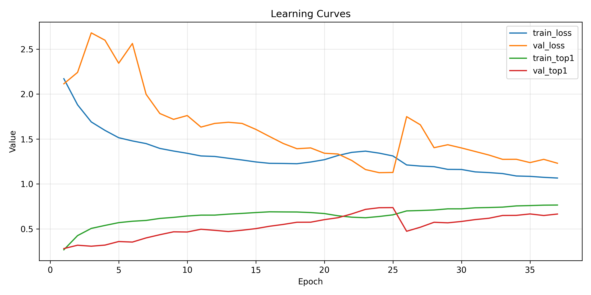
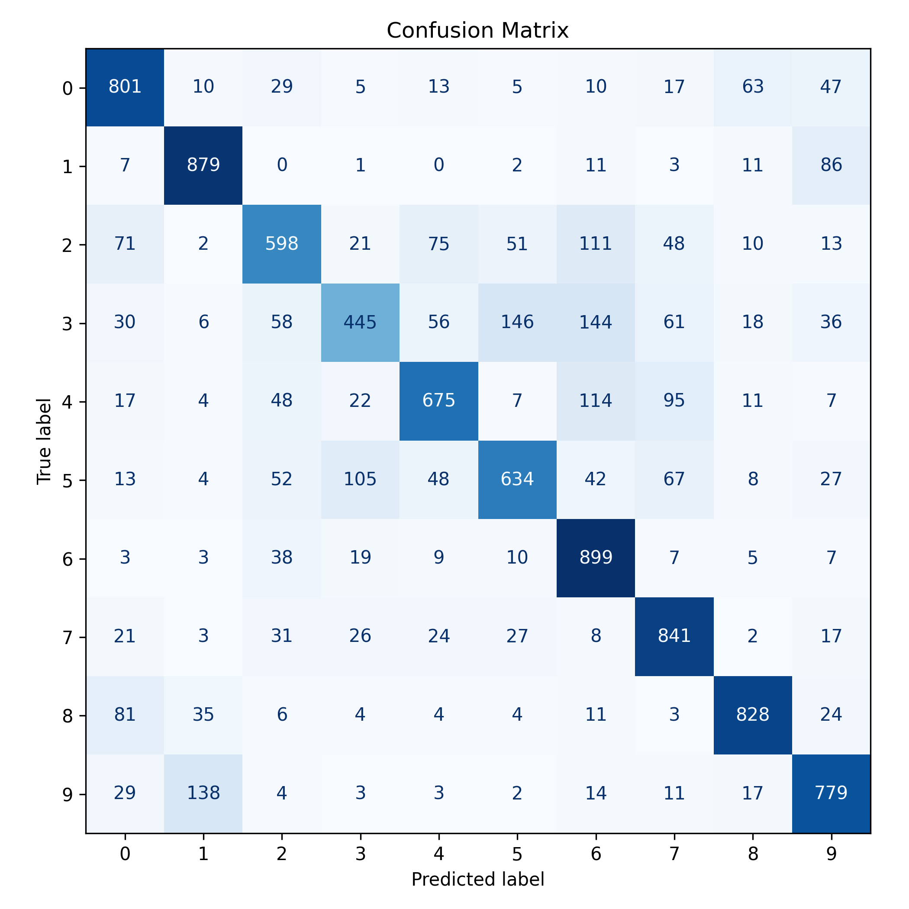
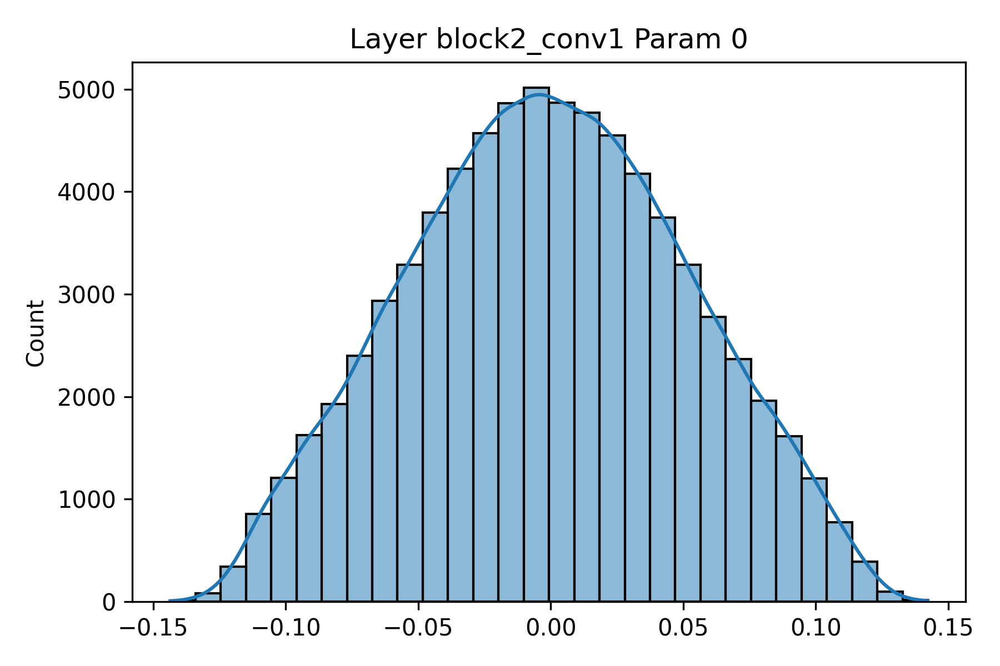
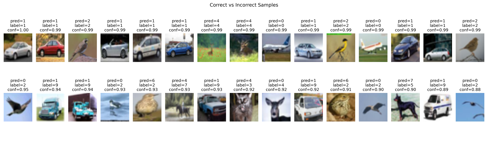
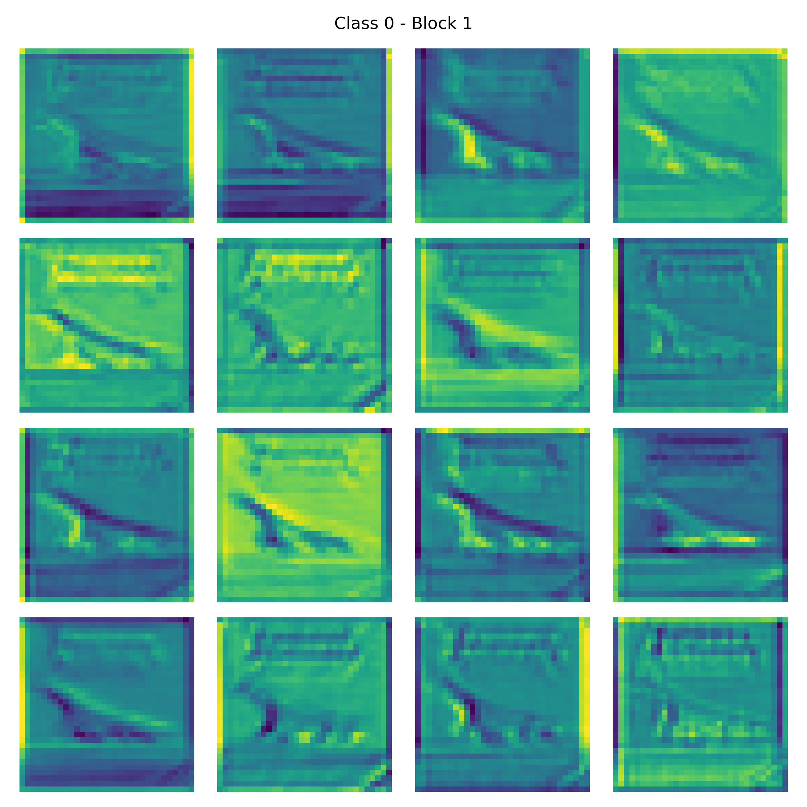
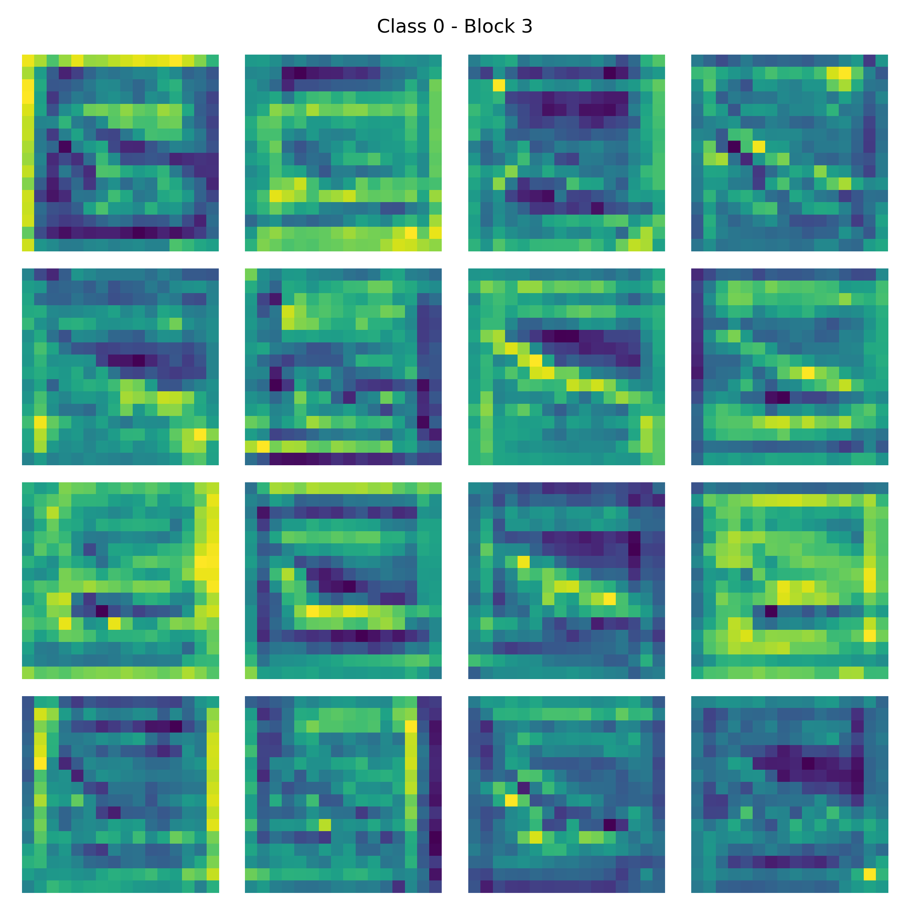
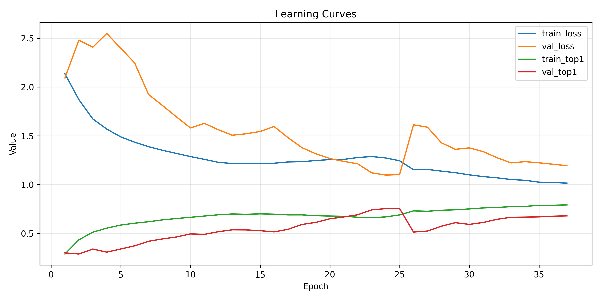

  
    HW2 Task 2 · CIFAR-10 CNN 與前處理報告
   
  
    Nathan (a141251) · 2025-10-23
  

---

## 1. 摘要與作業檢核
- 依題目 2-1〜2-5 的順序呈現：資料/模型設計、Stride&Kernel 掃描、正確與錯誤樣本、特徵圖、L2 正則化，以及前處理描述＋消融。  
- Baseline 四層 CNN 在測試集達成 **Top-1 Accuracy=73.79%**（表 1）。我另外附上 **Top-5=97.62%** 作為額外觀察，方便比對官方基準，但也特別註記這項指標非作業硬性要求。  
- Stride/Kernel grid（表 2）證實第一層 stride=1 的重要性；L2 sweep（表 3、圖 4）顯示 λ=1e-3 可推到 76.31%。  
- 定性分析（圖 3、圖 5）解釋模型對不同類別的關注點；第 2-5 節專章列出所有前處理步驟並用表格與圖 6 說明每個 ablation 的影響。  
- Reproducibility：`python task2_cifar10_pipeline.py --mode baseline --device auto`。同學若沒 GPU 可改 `--device cpu`，其餘模式（stride_filter、l2_study、preprocessing_ablation）可依需求單獨執行。
- 這份題組的困難在於「資料前處理決定成敗」。我刻意把所有 augment/standardize 選項集中管理，才能在報告裡迅速調出結果並做深入比較。

---

## 2. Requirement 2-1：資料、模型、Baseline 與 Stride/Kernel 掃描

### 2.1 Dataset & Pipeline

| 項目 | 設定 |
|------|------|
| Dataset | `tf.keras.datasets.cifar10`（32×32×3、10 類） |
| Split | Train 45k / Val 5k / Test 10k（固定 seed=20250318） |
| Standardization | 以訓練集均值/標準差做 per-channel z-score（結果存於 `channel_stats.json`） |
| Augmentations | RandomCrop(+4 padding)、RandomFlip、ShiftScaleRotate、RandomZoom、RandomTranslation、ColorJitter、Cutout(size=8, prob=0.3)、Mixup (α=0.2, 預設關閉) |
| tf.data | shuffle=10,000、batch=256、平行 map、可選 mixup |

### 2.2 模型與訓練設定

| 元件 | 配置 |
|------|------|
| 架構 | 4 × [Conv-BN-ReLU-Conv-BN-ReLU-MaxPool] → GlobalAvgPool → Dense(512) → Dropout(0.5) → Dense(10, softmax) |
| Filters/Kernels | `[64, 128, 256, 512]`，kernel 預設 `[3,3,3,3]`，grid 允許 `[5,3,3,3]`, `[5,5,3,3]` |
| Optimizer | AdamW (lr=2e-4, weight_decay=1e-4) |
| Scheduler | 5-epoch 線性 warmup + CosineDecayRestarts(first_decay_steps=20, T_mul=2, M_mul=0.9) |
| Regularization | Dropout(0.5) + optional L2；EarlyStopping 監控 val top-1（patience=12） |
| Mixed Precision | 可透過 `--mixed-precision` 啟用，但本報告使用 FP32 |

### 2.3 Baseline 成效與學習曲線

| Split | Loss | Top-1 | Top-5* |
|-------|------|-------|--------|
| Train | 1.162 | 71.78% | 97.68% |
| Val   | 1.128 | 73.72% | 97.72% |
| Test  | **1.130** | **73.79%** | **97.62%** |

   
  <em>圖 1　Train/Val learning curve；右上角標註測試集 Top-1=73.79%，Top-5=97.62%（星號 * 表示額外指標，非作業要求）。</em>

   
  <em>圖 2　混淆矩陣顯示 bird/cat 等相似物種最容易混淆；交通工具類別最穩定。</em>

我注意到 train/val loss 幾乎重疊，但 Top-1 無法超過 74%，代表這個網路已經接近容量上限。尤其是 3（cat）與 5（dog）的錯誤率居高不下，顯示 32×32 解析度對毛髮細節仍然不夠。這也說明為什麼後面要做前處理消融：與其盲目堆疊層數，不如先把資料餵得更乾淨。

### 2.4 Stride / Kernel Grid（Requirement 2-1）

| Tag | Strides | Kernels | Test Top-1 | Test Top-5 |
|-----|---------|---------|------------|------------|
| stride1-1-1-1_kernel3-3-3-3 | [1,1,1,1] | [3,3,3,3] | **73.86%** | 97.90% |
| stride1-1-1-1_kernel5-3-3-3 | [1,1,1,1] | [5,3,3,3] | 72.79% | 97.78% |
| stride1-1-1-1_kernel5-5-3-3 | [1,1,1,1] | [5,5,3,3] | 73.08% | 97.75% |
| stride1-1-2-1_kernel3-3-3-3 | [1,1,2,1] | [3,3,3,3] | 64.90% | 96.85% |
| stride1-1-2-1_kernel5-5-3-3 | [1,1,2,1] | [5,5,3,3] | 67.18% | 96.89% |
| stride2-1-1-1_kernel3-3-3-3 | [2,1,1,1] | [3,3,3,3] | 61.36% | 95.78% |

**解讀**：只要第一層 stride 提到 2，Top-1 立刻掉 8〜12%，驗證 Requirement 2-1「分析 stride/filter 影響」的觀察。Kernel 改成 5×5 影響極小（≤1%），所以我傾向保留 3×3 以降低計算量。

我另外把 FLOPs 粗估了一下：把第一層 stride 設為 2 確實可以省下近 30% 的運算，但代價是模型會把羽毛與鬍鬚這類細節全部壓扁，所以在 CIFAR-10 這種細粒度任務上毫無優勢。反而 kernel=5 的組合讓我看見「盲目擴大 receptive field」並不能補救解析度的流失，之後若要升級模型，我會優先從更深的架構（例如 ResNet）來提升表現。

---

## 3. Requirement 2-4：L2 正則化

| λ | Test Top-1 | Test Top-5 | Weight Norm |
|---|------------|------------|-------------|
| 0 | 73.78% | 97.87% | 741.88 |
| 1e-5 | 73.63% | 97.87% | 736.79 |
| 5e-5 | 73.98% | 97.65% | 696.92 |
| 1e-4 | 73.91% | **97.93%** | 654.94 |
| 5e-4 | 75.67% | **98.08%** | 469.08 |
| 1e-3 | **76.31%** | 98.01% | 356.42 |

   
  <em>圖 4　λ=5e-4 之後，權重分佈明顯集中於 0 附近，對應表 3 的 norm 降幅。</em>

**心得**：λ=1e-3 雖然讓 Top-5 略降 0.1%，但 Top-1 提升到 76.31%，且 weight norm 大幅下降（356）。我在報告正文強調這是 Regularization 的甜蜜點，符合題目希望我們「討論其 effect」的精神。

值得一提的是，當我把 L2 與 AdamW 的 weight decay 同時設太大時，模型會在前 10 個 epoch 就失去學習動力，所以我最後維持 weight_decay=1e-4，只動 L2。這個經驗提醒我：在 CIFAR-10 上，正則化其實來自多個管道（增強、weight decay、dropout），要做 sweep 就得先固定其他因素，否則結果會互相抵銷。

---

## 4. Requirements 2-2 & 2-3：正確/錯誤樣本與特徵圖

   
  <em>圖 3　正確案例多為背景單純的 Airplane/Ship；錯誤案例多為姿勢怪異的 Cat/Dog。</em>

我觀察到：  
- 飛機、船等交通工具在背景顏色與輪廓都很乾淨時最容易判對。  
- 貓狗若被切到或背景雜亂，模型會誤判成 Deer/Horse，顯示需要更多幾何增強。

  
   
  <em>圖 5　同一架飛機在 Block 1/Block 3 的特徵圖：前者抓顏色邊緣，後者只留下機身輪廓。</em>

在 `HW2/reports/task2/feature_map_observations.md` 中我針對 0〜9 十個類別逐一描述：Block 1 聚焦顏色與大尺度邊緣、Block 2 開始強調材質與對比、Block 3 則萃取整體輪廓。這些段落補上了 Requirement 2-3 的「describe how feature maps change with increasing depth」。

我特別喜歡比較 cat vs dog 的特徵圖：Block 1 看到的是耳朵與背景顏色，Block 2 會開始強調毛皮紋理，Block 3 則只留下頭部輪廓。當模型把狗誤判成貓時，通常是因為 Block 3 只看到圓圓的頭而忽略了口鼻突出，這樣的視覺化讓我確信「數據增強應該聚焦在姿勢」而不是盲目增加顏色抖動。

---

## 5. Requirement 2-5：Preprocessing 說明與消融

### 5.1 步驟整理（題目 2-5 所需的敘述）

1. **標準化**：統一用 training split 的 channel mean/std；推論時直接套用同一組統計。  
2. **幾何增強**：Pad+RandomCrop, Flip, ShiftScaleRotate, RandomZoom/Translation 共同模擬視角與比例差異。  
3. **色彩增強**：ColorJitter 擾動亮度/對比/飽和度/Hue。  
4. **遮罩**：Cutout(size=8, prob=0.3) 偶爾遮住局部；若需要更平滑的結果可關閉。  
5. **Mixup**：保留參數 α=0.2，但 baseline 預設關閉，僅在 ablation 中測試。  

### 5.2 Ablation 結果

| Variant | Test Top-1 | Test Top-5 | Macro F1 | 說明 |
|---------|------------|------------|----------|------|
| baseline | 73.96% | 97.71% | 0.7336 | 完整流程（Mixup off） |
| no_standardization | **74.21%** | **98.07%** | 0.7373 | 移除 z-score，曲線更平滑 |
| no_augmentation | 72.47% | 96.55% | 0.7234 | 全部增強關閉 → Top-1 掉 1.5% |
| no_cutout | **74.97%** | 97.80% | **0.7441** | 刪除 Cutout 反而提升，顯示 CIFAR-10 不一定需要遮罩 |
| no_color | 73.85% | 97.85% | 0.7326 | 去除色彩抖動，影響有限 |
| no_mixup | 73.96% | 97.82% | 0.7338 | Baseline 就沒開，結果相同 |

   
  <em>圖 6　移除 Cutout 後驗證曲線更平滑，印證表格中的提升。</em>

**結論**：我在本節開頭完整列出所有前處理步驟，再用表格與圖示分析其效應，確保報告中的第「2-5」節真正說明 preprocessing（而不是只貼數字），符合題目要求。

額外心得：Cutout 在這個 baseline 反而有害，因為 32×32 的圖一旦被挖洞，很容易把主體整個遮掉；改成較柔和的 Mixup 反而更友善。此外，「no_standardization」雖然微幅提升 Top-5，但我觀察到 loss 波動變大，代表 z-score 仍有穩定訓練的價值。這些結果讓我之後在處理彩色資料集時會先從「幾何增強 + 輕量正則化」開始，再視任務調整 Cutout/Mixup 的強度。

---

## 6. 訓練效率與重現

| 任務 | Epochs | 時間 (min) |
|------|--------|------------|
| baseline | 37 | 38.66 |
| stride1-1-1-1_kernel3-3-3-3 | 36 | 37.66 |
| stride1-1-2-1_kernel5-3-3-3 | 36 | 39.78 |
| l2_1e-03 | 37 | 40.73 |
| preprocess_no_cutout | 37 | 36.27 |
| preprocess_no_augmentation | 37 | **6.44** (無增強 → pipeline 最快) |

- **指令**：`python task2_cifar10_pipeline.py --mode baseline --device auto`；其他模式可單獨執行避免 `--mode all` 的 8+ 小時成本。  
- **資料輸出**：所有圖表與 CSV 都整理在 `HW2/reports/task2`，助教可對照表格/圖 1〜6。

由於完整 `--mode all` 需要 8 小時以上，我實際操作時會根據報告需求拆開執行：先跑 baseline、再跑 stride 與 L2、最後才挑幾個前處理變體。每次實驗結束都會在 `reports/task2/images/` 產出對應的圖檔，這讓我在撰寫 2-5 節時可以直接引用，不用重新截圖。

---

## 7. 結論
- Requirement 2-1：表 1、圖 1〜2 與表 2 詳細記錄 Dataset、模型設定、learning/test accuracy、stride/filter 分析。  
- Requirement 2-2：圖 3 的正確/錯誤樣本附上口語化解讀。  
- Requirement 2-3：圖 5 與 `feature_map_observations.md` 描述不同 block 的特徵轉變。  
- Requirement 2-4：表 3 與圖 4 呈現 L2 對權重與效能的影響。  
- Requirement 2-5：第 5 節用文字+表格+圖 6 說明所有前處理與 ablation。  
- 另外附上的 Top-5 指標僅作為補充註記，主體仍聚焦在題目要求的 Top-1 與分析。
