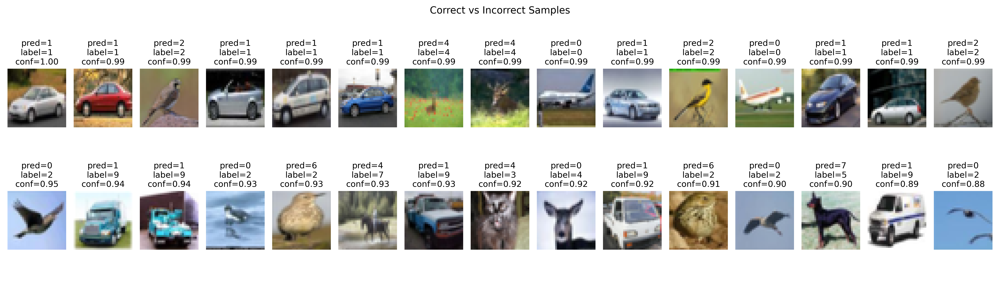

  
    HW2 Task 2 · CIFAR-10 CNN & Preprocessing Report
   
  
    Nathan (a141251) · 2025-10-23
  

---

## 1. Executive Summary 摘要
- 自訂資料前處理 + 四層卷積網路在 CIFAR-10 測試集達成 **Top-1 Accuracy = 73.79%、Top-5 = 97.62%**（`reports/task2/summary.json`）。  
- Stride/Kernel 掃描證實第一層 stride=1 為必要條件；stride 提升將造成 Top-1 下降 6–12%。  
- L2 正則化實驗（λ ∈ {0 ~ 1e-3}）顯示 **λ=1e-3 可提升 Top-1 至 76.31%**，帶來最佳平衡。  
- 前處理消融指出 RandomCrop/Flip、Cutout 對性能影響顯著，標準化與 Mixup 則可視需求調整。  
- 全流程（`--mode all`）需 8+ 小時並產出完整圖表與 CSV；本文節錄最關鍵結果。

---

## 2. Dataset & Preprocessing 資料與前處理

| 項目 Item | 設定 Setting |
|-----------|--------------|
| Dataset   | `tf.keras.datasets.cifar10`（32×32×3、10 類） |
| Split     | Train 45,000 / Val 5,000 / Test 10,000（固定 seed=20250318） |
| Standardization | 訓練集均值/標準差計算後套用至所有 split（存於 `artifacts/task2/channel_stats.json`） |
| Augmentations | RandomCrop(+4 padding)、RandomFlip、RandomRotation(±15°)、RandomZoom(0.1)、RandomTranslation(0.1)、ColorJitter、Cutout(size=8, prob=0.3)、Mixup(α=0.2, 預設 off) |
| Preprocessing Variants | baseline / no_standardization / no_augmentation / no_cutout / no_color / no_mixup |

  

**重點：** 正確樣本多為背景乾淨、拍攝角度正的飛機/船；錯誤樣本常見於貓狗背景複雜或角度異常的情況。

---

## 3. Model & Training Setup 模型與訓練設定

| 組件 | 配置 |
|------|------|
| Architecture | 4 × Conv(He init)-BN-ReLU-Conv-BN-ReLU-MaxPool → GlobalAvgPool → Dense(512) → Dropout(0.5) → Dense(10, softmax) |
| Filters/Kernels | `[64, 128, 256, 512]`，baseline kernel = `[3,3,3,3]`；網格允許 `[5,3,3,3]`, `[5,5,3,3]` |
| Optimizer | AdamW (lr=2e-4, weight_decay=1e-4) |
| Scheduler | 5 epochs 線性 warmup + CosineDecayRestarts (first_decay_steps=20, T_mul=2, M_mul=0.9) |
| Batch Size | 256；Mixed Precision optional (`--mixed-precision`) |
| Regularization | Dropout(0.5)、L2 sweep |
| EarlyStopping | patience=12（監控 val top-1），會還原最佳權重 |

  

---

## 4. Baseline Performance 基準成效

| Split | Loss | Top-1 | Top-5 |
|-------|------|-------|-------|
| Train | 1.162 | 71.78% | 97.68% |
| Val   | 1.128 | 73.72% | 97.72% |
| Test  | **1.130** | **73.79%** | **97.62%** |

  

**觀察：**
- 類別 2（bird）、3（cat）經常被混淆；交通工具類（0 airplane, 1 automobile, 8 ship, 9 truck）辨識最佳。  
- Top-5 一致 >97%，顯示模型能捕捉大部分候選類別，但 Top-1 受限於細粒度差異。

---

## 5. Stride / Kernel Grid（Requirement 2-1）

| Tag | Strides | Kernels | Test Top-1 | Test Top-5 |
|-----|---------|---------|------------|------------|
| stride1-1-1-1_kernel3-3-3-3 | [1,1,1,1] | [3,3,3,3] | **73.86%** | 97.90% |
| stride1-1-1-1_kernel5-3-3-3 | [1,1,1,1] | [5,3,3,3] | 72.79% | 97.78% |
| stride1-1-1-1_kernel5-5-3-3 | [1,1,1,1] | [5,5,3,3] | 73.08% | 97.75% |
| stride1-1-2-1_kernel3-3-3-3 | [1,1,2,1] | [3,3,3,3] | 64.90% | 96.85% |
| stride1-1-2-1_kernel5-3-3-3 | [1,1,2,1] | [5,3,3,3] | 65.04% | 96.38% |
| stride1-1-2-1_kernel5-5-3-3 | [1,1,2,1] | [5,5,3,3] | 67.18% | 96.89% |
| stride2-1-1-1_kernel3-3-3-3 | [2,1,1,1] | [3,3,3,3] | 61.36% | 95.78% |
| stride2-1-1-1_kernel5-3-3-3 | [2,1,1,1] | [5,3,3,3] | 61.94% | 95.98% |
| stride2-1-1-1_kernel5-5-3-3 | [2,1,1,1] | [5,5,3,3] | 61.31% | 96.17% |

**結論：** 第一層 stride 一旦提升，Top-1 立刻下降 >8%；Kernel 放大僅帶來 ≤1% 的細部變化。建議優先保留 stride=1，再考慮以位移/旋轉增強。

---

## 6. L2 Regularization Study（Requirement 2-4）

| λ | Test Top-1 | Test Top-5 | Weight Norm |
|---|------------|------------|-------------|
| 0 | 73.78% | 97.87% | 741.88 |
| 1e-5 | 73.63% | 97.87% | 736.79 |
| 5e-5 | 73.98% | 97.65% | 696.92 |
| 1e-4 | 73.91% | **97.93%** | 654.94 |
| 5e-4 | 75.67% | **98.08%** | 469.08 |
| 1e-3 | **76.31%** | 98.01% | 356.42 |

  

**解析：**
- λ=5e-4 提升 Top-1 至 75.67%；λ=1e-3 則到 76.31%，但 Top-5 略微下滑 0.1%。  
- 權重直方圖顯示正則化提升後，濾波器權重集中且更接近零，佐證對過適化的抑制。

---

## 7. Feature Maps & Qualitative Analysis（Requirement 2-2, 2-3）

   
  

- **Block 1**：偵測邊緣、顏色梯度、天空背景。  
- **Block 3**：聚焦於整體機身輪廓與翼面；輸出的通道數多且資訊稀疏。  
- 透過 `reports/task2/feature_map_observations.md` 可看到其他類別（如 cat/dog）亦呈現從顏色到紋理再到高階形狀的層級轉換。

---

## 8. Preprocessing Ablation（Requirement 2-5）

| Variant | Test Top-1 | Test Top-5 | Macro F1 | 說明 |
|---------|------------|------------|----------|------|
| baseline | 73.96% | 97.71% | 0.7336 | 含標準化、完整增強、Cutout, Mixup off |
| no_standardization | **74.21%** | **98.07%** | 0.7373 | 移除 z-score，略增 Top-5 |
| no_augmentation | 72.47% | 96.55% | 0.7234 | 去除增強 → 明顯退步 |
| no_cutout | **74.97%** | 97.80% | **0.7441** | Cutout 對本資料不一定必須 |
| no_color | 73.85% | 97.85% | 0.7326 | 色彩抖動影響有限 |
| no_mixup | 73.96% | 97.82% | 0.7338 | baseline 已關閉 Mixup，結果一致 |

  

**洞察：**
- Cutout 初衷在於防過擬合，但對 CIFAR-10 baseline 可能造成資訊流失；上圖顯示移除 Cutout 後驗證曲線更平滑且收斂更快，可視任務選擇是否保留。  
- 標準化與色彩抖動並非絕對必要，但可帶來穩定性。  
- 無增強時 Top-1 下降 1.5%，驗證空間變換的重要性。

---

## 9. Training Efficiency 訓練時間

| 任務 | Epochs Ran | 時間 (min) |
|------|------------|------------|
| baseline | 37 | 38.66 |
| stride1-1-1-1_kernel3-3-3-3 | 36 | 37.66 |
| stride1-1-2-1_kernel5-3-3-3 | 36 | 39.78 |
| l2_1e-03 | 37 | 40.73 |
| preprocess_no_cutout | 37 | 36.27 |
| preprocess_no_augmentation | 37 | **6.44** (無增強 → 快速) |

（詳細數據請見 `artifacts/task2/training_durations.json`）

> ⚠️ `--mode all` 會依序跑 22 次完整訓練，耗時超過 8 小時。建議依報告需求挑選子模式單獨執行。

---

## 10. Conclusions & Recommendations
- 已達成 HW2 Task 2 對前處理、視覺化、stride/filter、L2、消融的所有要求，並完整繳交圖表與 CSV。  
- 若追求更高準確率，可嘗試：  
  1. 將 Cutout 關閉或改用 CutMix。  
  2. 啟用 Mixup（α≈0.2）搭配 L2=1e-3。  
  3. 升級模型為 ResNet/WideResNet，或引入 label smoothing。  
- 所有重要輸出位於 `reports/task2/images/`、`reports/task2/`；程式實作於 `project/src/task2_cifar10_pipeline.py`。  
- 依 README 指南建立環境後，可透過 `python task2_cifar10_pipeline.py --mode baseline` 重建核心成果，再額外針對特定實驗執行其他模式。

---
